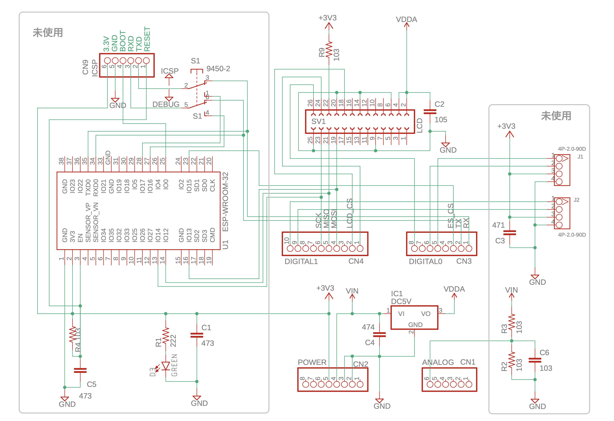
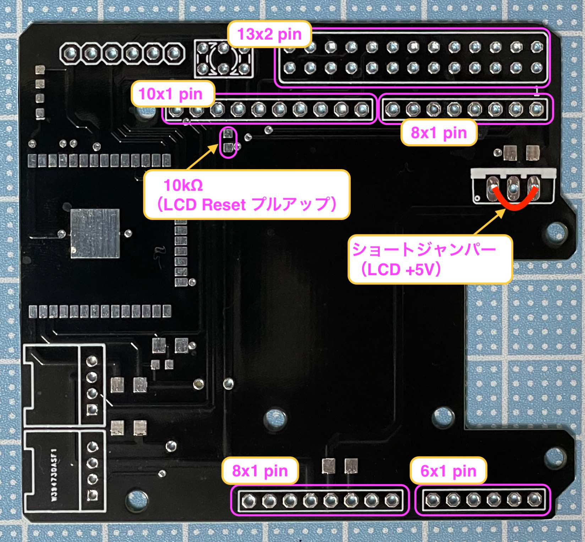

# Spresense-LCD-Board
## LCD board for Spresense
Spresenseの拡張ボードにスタックするLCDボードです
 
## 組み立て完成写真
  

## LCDボードとSpresense拡張ボード
  

## LCDボード回路図
  

## 使用するLCD

左）3.5 インチタッチスクリーン MHS TFT LCD モジュール[SPI 125MHz Support] 
右）GeeekPi 3.5インチ320 * 480モニタータッチパネル LCD[SPI 180MHz Support]　　
 
 
 

## ボードの組み立て
### - ピンヘッダー５組
### - プルアップ抵抗（10kΩ）
### - 電源シュートジャンパーを半田付け
### - カメラをカメラマウンターに取り付け  

 
 

### カメラマウンター 
 
### [カメラマウンター] DOC/SPRESENSE CAMERA BASE7.stl  
### [カメラマウンター　Tinkercad](https://www.tinkercad.com/things/2FAODkR43Zt-spresense-camera-base7)
  

## ビルド
1. フォルダ（camera_apitest）をArduinoスケッチフォルダーにコピー
2. ボードパッケージは "2.6.0" を使用します（3.xでは問題あり）
3. Memory:1536KBを選択
4. ライブラリーに "LovyanGFX" と "XPT2046_Touchscreen" をインストール
5. ビルドしてアップロード

  
## 使用方法
- オリジナルはSpresenseのサンプルスケッチ->camera->camera_apitest.inoです 
  LovyanGFXでプレビュー表示するする処理を追加 
  タッチパネル読み取り処理を追加 
  オリジナルにあるSerialターミナルでのメニュー操作はそのままです 
  （写真の解像度、ISO感度などの設定、撮影画像のSDへの保存などができます） 
- タッチパネルによる写真撮影処理を追加
- 撮影した写真のサムネイル表示処理を追加（最新の5枚まで表示）
  
## ライセンス
[LovyanGFX](https://github.com/lovyan03/LovyanGFX/tree/master) [FreeBSD](https://github.com/lovyan03/LovyanGFX/blob/master/license.txt) lovyan03
 
[camera_apitest.ino]() [GNU]() Sony Semiconductor Solutions Corporation
 
